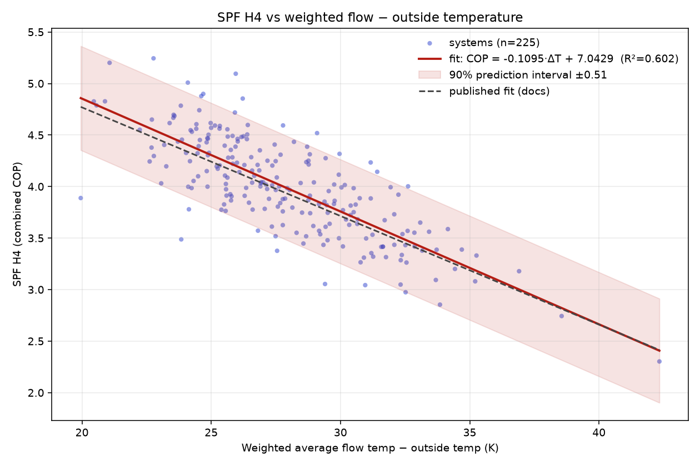

# Baseline: SPF vs weighted flow − outside temperature

Replication of the published low-temperature analysis
(https://docs.openenergymonitor.org/heatpumpmonitor/low_temperature.html) on
the current dataset export (`heatpumpmonitor_all_fields_last365_2026-07-15.csv`,
312 rows).

## Filters

The standard filter set, applied in order:

| Filter | Systems remaining |
|---|---|
| `metering_boundary_code == 4` | 268 |
| `hp_type == "Air Source"` | 263 |
| `cooling_heat_kwh < 1` | 228 |
| `combined_data_length ≥ 330 days` | 226 |
| MID metering (`mid_metering == 1`) | 226 (export is pre-filtered) |
| both `combined_cop` and `weighted_flowT_minus_outsideT` present | **225** |

Note: the previously quoted "~268 homes" corresponds to boundary code 4 alone;
the cooling exclusion is the big additional cut (−35 systems). The result is
robust to it — without the cooling filter: n = 258, slope −0.0907, R² = 0.463.

## Result: the relationship replicates almost exactly

| | slope | intercept | R² | 90% PI |
|---|---|---|---|---|
| Published (docs) | −0.1054 | 6.8762 | 0.547 | ±0.53 |
| Current data (n = 225) | −0.1095 | 7.0429 | 0.602 | ±0.51 |

Predicted SPF at reference points (current vs published): 25 K → 4.31 vs 4.24;
30 K → 3.76 vs 3.71; 35 K → 3.21 vs 3.19. The correlation has strengthened
slightly with newer data.

## Functional form checks

Tested later in the residual work (cross-validated): quadratic in ΔT, Carnot
COP of the weighted temps, log–log — none beat the plain linear fit on ΔT
(all cv R² 0.56–0.59 vs 0.594). The linear form is not the limitation; the
information content of a single averaged ΔT is (see doc 04/05).

## Code

`analysis/hpmon_analysis.py` — loader, `standard_filter()` (per-step counts,
adjustable thresholds), `linfit()` (slope/intercept/R²/RMSE/90% PI),
comparison against the published reference, plot. Auto-picks the newest
`heatpumpmonitor_all_fields_*.csv` in the project root.
