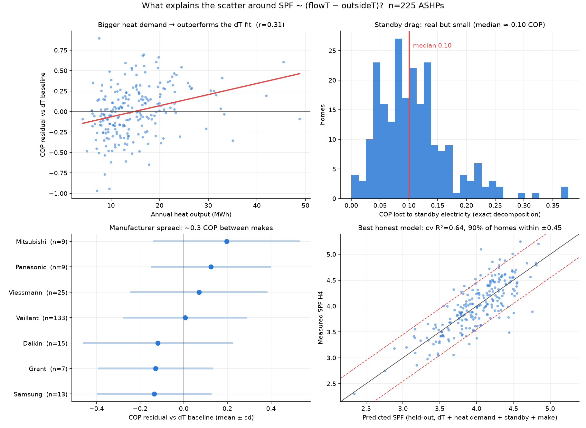

# Residual analysis: what explains the ±0.51 scatter?

Starting question: the SPF ~ ΔT baseline (doc 01) leaves a 90% prediction
interval of ±0.51. Three hypotheses were proposed: (1) compressor modulation
pattern affects COP at the same temperatures, (2) primary pipework volume
between heat pump and heat meter shows up as missing heat, (3) standby
electricity drags down combined COP in low-demand homes.

## Hypothesis tests

**Standby drag — confirmed, exactly quantifiable.** Since
`combined_cop = running_cop / (1 + standby_elec/running_elec)`, no model is
needed: penalty median **0.10 COP**, p90 0.19, worst 0.38 (fleet standby
electricity: median 73 kWh/yr, max 323). But refitting the baseline with
standby removed only lifts R² 0.602 → 0.625 — a slice, not the bulk.

**Modulation — real but invisible in annual aggregates.** Mean load factor
while running (`running_heat_mean / hp_output`) correlates with the residual
at only ρ = 0.19; cycling (`starts_per_run_hour`) at r = −0.16. An annual mean
cannot distinguish a unit that spends 30% of its energy at maximum speed from
one that never leaves minimum. (Docs 03–05 pursue this properly.)

**Pipework — no field captures it.** Its expected signature (a fixed loss,
proportionally worse in small systems) is consistent with the strongest
residual correlate found: **annual heat output, ρ = 0.36** — high-demand homes
systematically beat the ΔT fit. But this variable is degenerate with all three
mechanisms (big-demand homes amortise standby, amortise pipework losses, and
run steadier), so annual aggregates cannot separate them.

Other findings: ~0.3 COP spread between manufacturer means (Mitsubishi +0.20
… Samsung/Grant/Daikin ≈ −0.13) with large within-make scatter; flow−return
ΔT, DHW fraction, room temp, oversizing factor, data-quality fields — all ≈ 0.

## The honest predictive ceiling (published aggregates only)

All models 5-fold cross-validated:

| Model | cv R² | 90% |err| |
|---|---|---|
| ΔT only | 0.594 | ±0.50 |
| ΔT + annual heat demand | 0.634 | ±0.47 |
| ΔT + heat + standby + make | 0.637 | ±0.45 |
| all safe features, GBM | 0.55 | (overfits) |

Interpretable best small model:
`SPF = 6.93 − 0.115·ΔT + 0.117·(annual MWh) − 1.63·(standby elec fraction)`

## Leakage rules (learned the hard way)

A first "kitchen sink" model scored cv R² 0.85 — fake. Giving a model both
heat-side and electricity-side power/energy quantities lets it reconstruct
COP from their ratio. Rules: never mix heat-side and elec-side quantities as
features; `prc_carnot`, `water_cop`, `running_cop` are restatements of the
target; evaluate held-out.

## The PI arithmetic

The PI scales with √(1−R²), so R² gains barely move it: ±0.46 needs R² ≈ 0.65
(achieved), ±0.25 needs ≈ 0.90, ±0.10 needs ≈ 0.984. This framing motivated
everything after: better *features* (docs 03–05), not better model classes.
(Metering floor initially estimated at ±0.13–0.22, later revised to ~±0.10 —
see doc 06.)

## Code

`analysis/residual_analysis.py` (features, correlation table, standby
decomposition, CV harness), `analysis/residual_plots.py` (figure).
