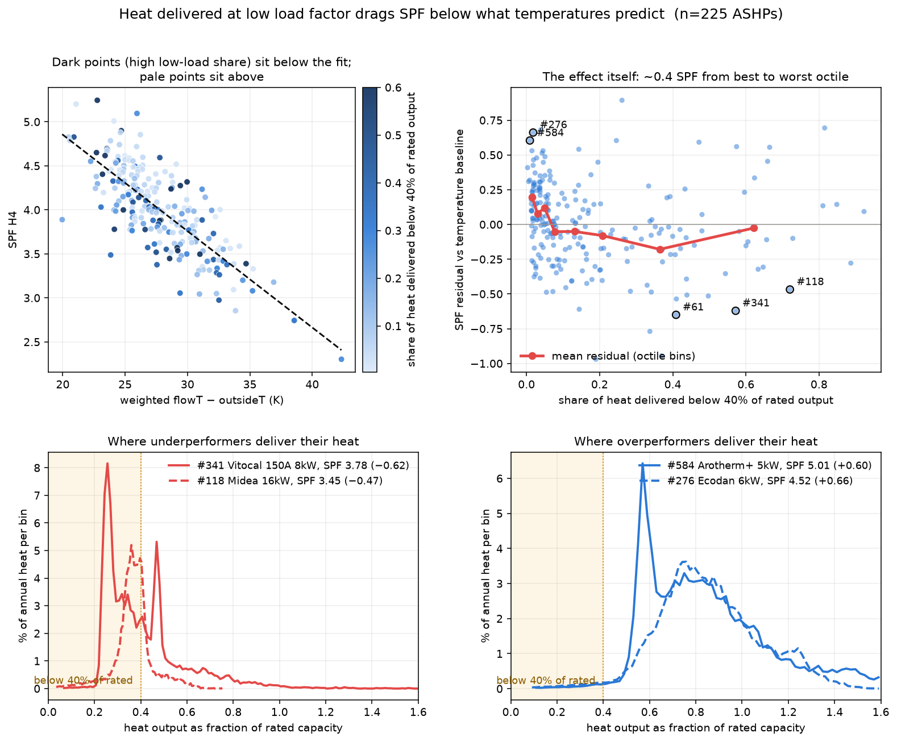

# Power histograms: the low-load-factor effect

First use of per-system distributional data beyond the published aggregates:
the heatpumpmonitor.org histogram endpoint

```
https://heatpumpmonitor.org/histogram/kwh_at_power_elec?id=<id>&start=<t>&end=<t>&x_min=0&x_max=30000
```

(`kwh_at_power_elec`: electricity kWh binned by instantaneous input power;
`kwh_at_power_heat`: heat kWh binned by output power. The endpoint auto-ranges
— it clamps `max` to where data exists and picks its own bin width, so a
generous fixed `x_max` works for all systems. Note: requests need a
non-default User-Agent; `Python-urllib` gets 403.)

Fetched both histograms for the filtered fleet (223/225 systems, cached in
`histograms/`). Data validated: standby share computed from the histograms
matches the CSV-derived standby fraction at r = 0.98.

## Key finding: low-load-share predicts underperformance

`heat_frac_below_40pct` — the fraction of annual heat delivered below 40% of
rated output — is the strongest single residual correlate found in the fleet
data:

- ρ = **−0.33** with the baseline residual: systems delivering much of their
  heat at low load factor do *worse* than their temperatures predict — the
  opposite of the naive "low compressor speed = efficient" intuition (below
  minimum modulation you cycle; fixed parasitics are proportionally huge).
- Not the small-home effect in disguise: partial correlation controlling for
  annual heat demand is still −0.28 (p ≈ 2×10⁻⁵). Best read as
  *oversizing-in-operation* (ρ = −0.61 with equivalent full-load hours).
- Adds real predictive power: ΔT + heat + low-load share → cv R² **0.652**,
  90% PI ±0.46 (repeated CV; vs 0.628/±0.48 without it).
- Distribution: median system delivers only 10% of heat below 40% of rated;
  the top-15% group delivers 40–72% there. Group means: −0.06 vs +0.17
  residual (≈0.23 COP between groups).

Example systems — high low-load share, underperforming: #61 (Nibe F2040 12 kW,
41%, resid −0.65), #341 (Vitocal 150A 8 kW, 57%, −0.62), #97 (Aerona3 10 kW,
41%, −0.54), #118 (Midea 16 kW, 72%, −0.47). Near-zero low-load share,
overperforming: #276 (Ecodan 6 kW, 2%, +0.66), #584 (Arotherm+ 5 kW, 1%,
+0.60), #568, #643, #441 — all 2000–3900 equivalent full-load hours.



## Null result that mattered

Elec-side modulation features normalised to each system's own max input power
(fraction of energy above 60/80% of max) showed almost nothing (ρ ≈ −0.11).
Interpretation: the annual 1-D histogram marginalises over weather — high
power is mostly cold-weather energy whose COP penalty ΔT already captures.
The modulation effect operates *at fixed temperature*, which a 1-D histogram
cannot see. This pointed directly at the simulator work (doc 04) and the H\*
metric (doc 05). The raw-feed fleet test (doc 09) later settled what the
low-load penalty *is*: a **quality/sizing effect** (which machine and sizing
you bought, with compressor efficiency poorest at minimum modulation), not
an operating-temperature effect — so it is invisible to any metric built
from temperatures and load alone, and partially self-cancelling in annual
SPF. The effect found here is real, but modelling it as extra thermodynamic
lift (H\*) made prediction worse, not better.

## Code / data

`analysis/fetch_histograms.py` (cached fetcher), `analysis/modulation_analysis.py`
(features + correlations + CV), `analysis/lowload_plots.py` (figure),
`modulation_features.csv` (per-system features + residuals), `histograms/`
(raw JSON cache).
