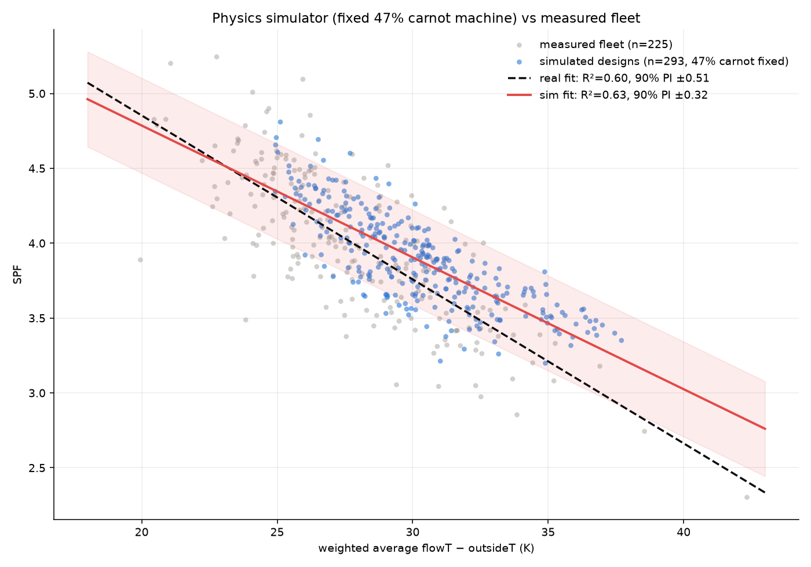

# Simulator Monte Carlo: how much spread does physics alone produce?

Approach change: instead of explaining the fleet's scatter from the data,
generate a synthetic fleet from the dynamic heat pump simulator
(`dynamic_heatpump/`, the browser tool) and see how much scatter a
physics-only world produces around the SPF ~ ΔT line.

## Harness

`sim_harness/engine.js` loads the **unmodified** tool source in a Node `vm`
sandbox: Vue/jQuery/DOM stubbed, `setTimeout` made synchronous so
`app.simulate()` runs inline, plotting neutralised, the Llanberis 2024
half-hourly weather CSV injected directly (bypassing `fetch`), and persistent
sim state reset between runs. `runScenario(config)` returns SPF, weighted
temperature stats, % carnot, DHW split, comfort stats — plus (added for doc
05) candidate metrics computed from the 30 s timeseries.

`sim_harness/run_scenarios.js` runs a seeded Monte Carlo over system designs,
parallelised over worker threads (~10 s per simulated year; 400 scenarios ≈
16 min on 10 workers). Output: `sim_results.csv`.

Fixed for all scenarios: full-year mode, single-PI control (AUTO_ADAPT),
`carnot_variable` COP model at **47% of Carnot** — i.e. an identical machine
everywhere. Varied: heat loss (2–9 kW), capacity ratio (1.0–2.2×), emitter
sizing (1.2–3.2× heat loss at ΔT50), system volume, flow rate, minimum
modulation, standby/pump power, solar/internal gains, DHW volume and
setpoints, room setpoints, setback vs constant. Scenarios failing comfort
(>2500 degree-hours below setpoint) excluded → n = 293.

## Result

| | slope | intercept | R² | 90% PI |
|---|---|---|---|---|
| Measured fleet (n=225) | −0.110 | 7.04 | 0.60 | ±0.51 |
| Simulated fleet (n=293, identical machine) | −0.088 | 6.55 | 0.63 | **±0.32** |

**About two-thirds of the fleet's spread is reproduced with zero machine
variation, zero install-quality variation, and zero metering error.** The
single-number ΔT summary is intrinsically leaky.

The simulator's own residual correlates at **r = 0.965 with achieved
% carnot** — which varies 0.44–0.51 despite the fixed 47% input, purely from
operating point. Its drivers mirror the real fleet's residual correlates:
total heat demand (+0.80), capacity (+0.83), DHW fraction (−0.78). Emitter
ratio and sizing contribute ≈ nothing *once ΔT is given* (they act through
ΔT).

## Caveats

- The ±0.32 depends on the sampled design-space ranges (documented in
  `makeScenarios()`); matching the fleet's real design distribution would
  sharpen the comparison.
- Sim slope is shallower (−0.088 vs −0.110): no defrost model, and real
  high-ΔT systems may also be systematically worse machines.
- Comfort filter threshold is a judgement call.

## Consequence

If physics with an identical machine produces ±0.32, the search for better
prediction should target the *operating-pattern information* that ΔT throws
away — which led to the metric search and H\* (doc 05).
