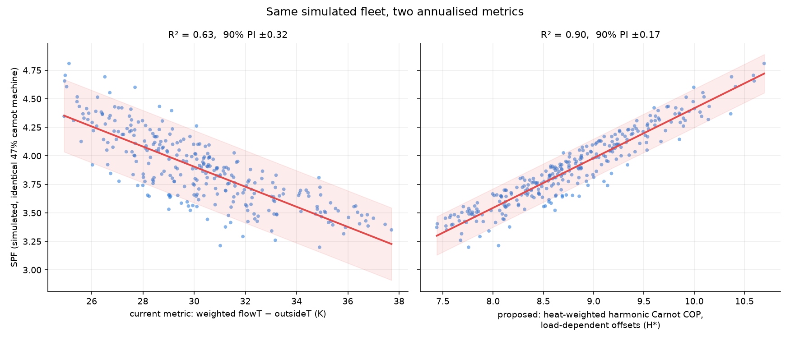

# H\*: heat-weighted harmonic Carnot COP with load-dependent offsets

> **Status (July 2026): tested against raw fleet feeds and NOT adopted —
> see doc 09 for the empirical results.** On 229 validation-clean air
> source systems H\* predicts SPF *worse* than weighted dT (cv R² 0.48 vs
> 0.60), and a 1092-combo offset grid search over the whole
> fixed + load-dependent family found the optimal load coefficient is
> exactly zero, under both badge and empirically-normalised capacity. The
> within-machine load penalty this metric models is real at steady state
> (manufacturer compressor maps confirm it), but the net load signal in
> annual fleet SPF is ≈ 0: either an opposing while-running effect cancels
> the penalty, or the penalty does not annualise to the modelled size over
> real operating distributions (doc 09 discusses, doc 10 proposes the
> discriminating measurement). The expected gain landed at the bottom of
> the caveat range below. The document is kept as the design record of the
> metric and of the simulator testbed results.

A proposed annualised metric for heat pump monitoring that predicts seasonal
performance (SPF) substantially better than the current best single metric,
weighted average flow temperature minus outside temperature. Like the existing
weighted temperature statistics it is computed from the heat and temperature
feeds only — no electricity data is involved — so it can be used as an honest
predictor of COP rather than a restatement of it.

## Why weighted flowT − outsideT leaks

`SPF ~ weighted(flowT − outsideT)` explains about 60% of the between-system
variance in the HeatpumpMonitor.org fleet (R² ≈ 0.60, 90% prediction interval
≈ ±0.5 SPF). Running a physics simulator (dynamic_heatpump) over ~300 randomised
system designs with an *identical* machine (fixed 47% of Carnot) reproduces
about two-thirds of that spread — so most of the scatter is not machine quality,
data error, or install workmanship. It is information that a single averaged ΔT
cannot carry. Two separate effects are responsible:

**1. Wrong averaging (the small effect).** Electricity use is the sum of
`heat / COP` at each instant, so the correct annual aggregate of the Carnot COP
is a heat-weighted *harmonic* mean, not the Carnot of the average temperatures.
Two systems with the same average ΔT but different ΔT distributions use
different amounts of electricity. In both the simulator and the real fleet this
correction alone turns out to be worth surprisingly little (R² 0.60 → 0.64):
necessary, but not the main leak.

**2. Load-dependent temperature lift (the big effect).** The temperatures we
monitor — water flow temperature and outside air temperature — are not the
temperatures the refrigerant cycle sees. The condensing temperature sits above
the water temperature by an approach ΔT across the condenser, and the
evaporating temperature sits below the air temperature by a (larger) ΔT across
the evaporator. Crucially, **both gaps grow with compressor output**: at high
load the heat exchangers need a bigger temperature difference to move more heat.
This is why a Vaillant Arotherm at 100–120 rps has a much lower COP than at
40 rps *at the same flow and outside temperature* — the effective thermodynamic
lift is larger even though the monitored temperatures are identical.

A metric built from monitored temperatures alone is blind to this. A metric
that reconstructs the *effective* condenser and evaporator temperatures from
the instantaneous load ratio captures it. In the simulator testbed, adding the
load-dependent offsets is what takes R² from 0.64 to 0.90 and halves the 90%
prediction interval (±0.32 → ±0.16 SPF).

## Definition

At each monitored timestep where the heat pump is running:

```
r        = heat / rated_capacity                      # instantaneous load ratio, 0..~1.2
Tcond    = flowT    + a * r                           # effective condensing temp, °C
Tevap    = outsideT - b * r                           # effective evaporating temp, °C
carnot   = (Tcond + 273.15) / (Tcond - Tevap)         # ideal COP at effective temps
```

with default offset coefficients `a = 3` K and `b = 8` K (per unit load ratio),
taken from the dynamic_heatpump "carnot variable" model. The annual metric is
the heat-weighted harmonic mean:

```
H* = Σ(heat) / Σ(heat / carnot)
```

`Σ(heat / carnot)` is, physically, the electricity a perfect (100% of Carnot)
machine would have used. So `H*` is "the ideal COP this system's actual
operating pattern permitted", folding together in one number: how hot the water
was, how cold the air was, *when* the heat was delivered, and *how hard the
machine was working* at each moment.

Predicted performance is then simply `SPF ≈ η · H*` where η is the fraction of
Carnot achieved (≈ 0.45–0.50 for current ASHPs), and the ratio `SPF / H*` is a
**modulation-corrected percent-of-Carnot** — a fairer machine/install quality
score than the current `prc_carnot`, because operating-pattern effects have
already been removed by the denominator.

## Pseudo-code

Designed to drop into the same single pass that already accumulates
`weighted_flowT`, `weighted_outsideT` etc. One extra accumulator, no extra
passes, no electricity feed.

```
# inputs per system:
#   heat[t]      heat output power, W        (heat meter feed)
#   flowT[t]     flow temperature, °C
#   outsideT[t]  outside air temperature, °C
#   capacity     rated heat output, W        (from system metadata)
# constants:
A_COND = 3.0        # K of condenser approach per unit load ratio
B_EVAP = 8.0        # K of evaporator drop per unit load ratio

sum_heat        = 0
sum_ideal_elec  = 0

for t in timesteps:
    h = heat[t]
    if h <= 0: continue                    # accumulate while running only

    r     = h / capacity
    Tcond = flowT[t]    + A_COND * r
    Tevap = outsideT[t] - B_EVAP * r

    lift = Tcond - Tevap
    if lift <= 0: continue                 # guard (cannot occur while heating)

    carnot = (Tcond + 273.15) / lift

    sum_heat       += h * dt
    sum_ideal_elec += (h / carnot) * dt

H_star = sum_heat / sum_ideal_elec

# derived quality score, computed after the fact from published stats:
prc_carnot_corrected = combined_cop / H_star
```

### Practical notes

- **Resolution.** The metric is a nonlinear function of instantaneous load
  ratio, so it should be accumulated at (or near) the native feed resolution —
  the same 10–30 s data the existing weighted stats use. Computing it from
  daily or even half-hourly *averages* re-introduces the aggregation error the
  metric exists to remove (a machine cycling between 0 and 100% looks like a
  steady 50% in averaged data).
- **Running filter.** Only accumulate while heat is being delivered (`h > 0`,
  or the same running-state condition used for the existing running stats).
  Standby and off periods contribute no heat and must not contribute ideal
  electricity.
- **DHW included.** Hot water runs are high-flow-temperature, high-load-ratio
  periods; the metric prices them correctly, which is exactly how it absorbs
  most of the DHW-fraction effect on SPF.
- **Defrost / negative heat.** Skip negative heat samples (the `h <= 0` guard);
  defrost energy debt shows up as reduced measured SPF, not in H\*. The gap is
  informative: defrost-heavy systems will show a lower `SPF / H*`.
- **Capacity.** Use rated heat output at a defined condition (the existing
  `hp_output` metadata field). Errors in capacity shift a system's H\* slightly
  but coherently; a wrongly-entered capacity is visible as an outlier in
  `SPF / H*`.
- **Offsets a, b.** 3 K and 8 K per unit load are generic values from the
  simulator's variable-offset Carnot model. Real machines differ (that residual
  difference is machine quality, which belongs in η, not in H\*). Treat them as
  fixed conventions of the metric — like the +2/−6 in the existing fixed-offset
  `prc_carnot` — rather than per-machine tuning parameters.

## Evidence so far

Simulator testbed (293 randomised system designs, identical 47%-of-Carnot
machine, full-year half-hourly Llanberis 2024 weather, single-PI control,
cross-validated linear fits):

| Annual metric | cv R² | 90% PI |
|---|---|---|
| weighted flowT − outsideT (current) | 0.63 | ±0.34 |
| harmonic Carnot, fixed +2/−6 offsets | 0.64 | ±0.32 |
| **H\* (harmonic Carnot, load-dependent offsets)** | **0.90** | **±0.16** |
| H\* + runtime fraction + starts/day + DHW share | 0.93 | ±0.13 |



Real-fleet check of the *fixed-offset* variant (recoverable from published
fields as `combined_cop / combined_prc_carnot`, n = 225): R² 0.598 vs 0.594 for
ΔT — matching the simulator's prediction that fixed-offset harmonic averaging
alone gains almost nothing. The load-dependent variant cannot be computed from
currently published aggregates; it needs the one-pass accumulator above run
against raw feeds.

**Caveat.** The simulator's COP model *is* a variable-offset Carnot, so part of
its near-perfect R² is the metric matching the true functional form. Real
machines have different effective offsets, defrost behaviour, and flow-rate
effects. The expected real-world gain is therefore somewhere between the two
rows (0.64 … 0.90), to be established empirically.

## What the fixed offsets do to the published % of Carnot

The published quality metric (`combined_prc_carnot`, fixed +2/−6 offsets) was
tested against the variable-offset convention on the simulator sweep, where
every system is *by construction* an identical machine at exactly 47% of
variable-offset Carnot — so any spread or bias in an apparent %-carnot figure
is an artifact of the metric (`analysis/prc_carnot_offsets.py`):

| Apparent % of Carnot (identical 47% machines) | median | IQR | sd |
|---|---|---|---|
| fixed +2/−6 (published convention) | 0.474 | 0.455–0.485 | 0.023 |
| fixed +2/−6, running COP (`wa_prc_carnot`) | 0.482 | 0.466–0.492 | 0.019 |
| variable +3r/−8r (H\* convention) | 0.444 | 0.436–0.451 | 0.012 |

Three consequences:

1. **The fixed-offset figure reads ~3 points higher** than the variable-offset
   one (0.474 vs 0.444): at typical load ratios (r ≈ 0.3–0.5) the fixed +2/−6
   offsets overstate the real temperature lift, understating the ideal COP and
   flattering the machine. The fleet's published median of 0.481 is therefore
   consistent with a variable-offset field median of ≈ 0.45 — which is exactly
   what the design-model work finds (`SPF / H*_design` median 0.458, doc 08),
   and, after removing defrost (−2 points), a bench machine quality of ≈ 0.48.
   The 0.444 vs 0.470 gap on the sim is standby/pump drag plus cycling, not
   metric error.
2. **The fixed-offset figure is strongly load-dependent for identical
   machines** (r = −0.75 with mean load factor): the same machine reads 0.496
   at load factor 0.2–0.35 but 0.451 at 0.5–0.7. Oversized, low-load systems
   are flattered by up to ~5 points. The variable-offset convention shrinks
   both the artifact (r = −0.21, mostly standby drag) and the overall spread
   (sd halves, 0.023 → 0.012).
3. **In the real fleet the artifact masks a genuine effect:** published
   `prc_carnot` shows no load-factor slope (r = +0.08), but identical machines
   would show −0.75 — so real quality must *rise* with load factor by roughly
   the amount the metric flatters low-load systems. The fixed-offset
   convention is hiding the oversizing-in-operation penalty (doc 03) inside a
   metric that looks flat.

## Suggested next steps — outcome (July 2026, see doc 09)

1. ~~Compute H\* from raw feeds for a subset of well-monitored systems and test
   whether `SPF / H*` shows less between-system spread than `combined_prc_carnot`.~~
   **Done** (`scripts/feed_scan/feed_scan_4.php`, 229 clean systems): SPF/H\*
   spread is not smaller (sd 0.041 vs 0.037), so the success criterion was
   not met. SPF/H\* does however *expose* the sizing/load effect the fixed
   score hides (corr with load factor +0.48 vs +0.07), making it a useful
   diagnostic axis rather than a fairer ranking.
2. **Not adopted** — step 1's criterion failed, and H\* predicts SPF worse
   than weighted dT (cv R² 0.48 vs 0.60).
3. **Tested and closed**: the prediction interval does not halve, it widens
   (±0.58 vs ±0.51). An offset grid search over the full metric family
   (`analyse_hstar_offsets.py`, histogram from `feed_scan_5.php`) found no
   coefficients that beat dT; the optimal load coefficient is zero.

---
*Background: this metric came out of a residual analysis of the
HeatpumpMonitor.org fleet (July 2026) — the scatter around the SPF ~ ΔT line
correlates with achieved %-of-Carnot, annual heat demand, and the share of heat
delivered below 40% of rated output. A Monte Carlo sweep of the dynamic_heatpump
simulator (`sim_harness/`) showed that ~⅔ of the fleet's ±0.5 spread is
reproduced by physics alone with an identical machine, and that H\* is the
annualised statistic that captures most of it. Analysis code:
`analysis/metric_comparison.py`, `sim_harness/engine.js` (JS implementation of the
accumulator over the simulator's timeseries).*
