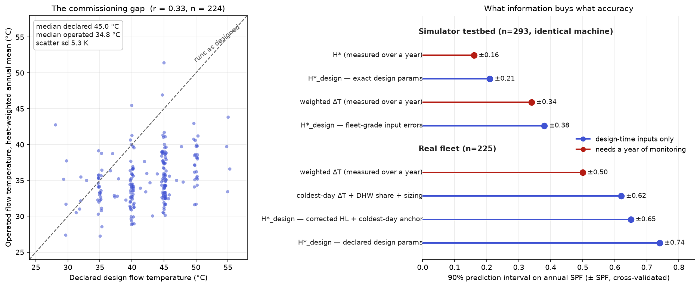

# Predicting SPF from Design Parameters

## Why a design-time prediction?

The best predictors of seasonal performance found so far in this project —
weighted ΔT and H\* — share one important limitation: they are calculated
from a full year of monitoring data. In other words, the system must be
built, commissioned and run for a year before we can "predict" how well it
performs. That is useful for understanding a fleet, but it is the wrong way
round for a designer, who needs an answer *before* the system exists.

What a designer has instead is the design sheet: the calculated heat loss,
the design flow temperature, the emitter sizing, the expected hot water
share and cylinder target temperature. The question this page asks is
whether a simple closed-form model, built from nothing more than those
standard design parameters, can approach the prediction accuracy of the
best measured metrics — without the complexity of a full physics
simulation.

The short answer, explored below, is that it can — but only if the design
sheet tells the truth. The two results together turn out to say more about
the quality of installation metadata than about modelling technique.

## How the model works

The model uses no simulation and no monitoring data. The idea is
straightforward: the design parameters define the weather-compensation
curve that the system *should* run. A standard weather year then converts
that curve into a distribution of flow temperatures and load ratios across
the heating season, and from that distribution we can calculate H\* (see
doc 05) as a simple closed-form sum.

For each half-hourly weather sample at outside temperature `T`, we
calculate:

```
Q(t)      = U · (room − T) − gains − solar(t)·aperture·0.9    net space demand,
            smoothed over 24 h (thermal mass), clipped to [0, capacity]
MWT(t)    = room + 50 · (Q / rad50)^(1/1.3)          radiator equation
flowT(t)  = MWT + system_DT / 2
r(t)      = max(Q, min_mod·capacity) / capacity      instantaneous load ratio
carnot(t) = (flowT + 3r + 273.15) / ((flowT + 3r) − (T − 8r))

H*_design = Σ heat / Σ (heat / carnot)               + DHW block at its target temp
SPF       ≈ η · H*_design
```

Taking the lines one at a time: the first is a plain heat-loss balance —
demand is whatever the fabric loses, minus internal gains and minus solar
gains through an effective aperture. The radiator equation then tells us
what mean water temperature the emitters need to deliver that output, the
flow temperature sits half the system ΔT above it, and the Carnot
expression converts flow temperature and load ratio into an ideal COP
(with small corrections for load-dependent heat-exchanger temperature
differences). Summing over the year gives `H*_design`, and the predicted
SPF is simply a fixed fraction η of it — the "percentage of Carnot" that
real machines achieve.

The 24-hour smoothing of demand deserves a note: it is the closed-form
stand-in for thermal mass. A midday solar surplus is allowed to offset
evening demand within the 24-hour window; any surplus beyond that is
discarded, mirroring the overheating-utilisation limit in the dynamic
model.

The code is in `analysis/design_model.py`. There is also an interactive
single-page version (Vue, self-contained) at `design_spf_tool/index.html`;
its JavaScript implementation has been verified against the Python
reference to better than 0.3%.

### What you will need

The inputs are all standard design-sheet quantities:

- Heat loss at a design outside temperature.
- Room setpoint.
- Emitter capacity — or equivalently, the design flow temperature at the
  design condition.
- System ΔT (flow minus return).
- Rated heat pump capacity.
- Assessed DHW share and DHW target temperature.
- Internal gains (body heat plus lighting and appliances, in watts) and a
  solar aperture in m², mirroring the gains structure of the dynamic model
  (defaults 290 W and 4 m²).
- A standard weather year — temperature *and* solar irradiance.

Only one global constant was tuned: the minimum modulation ratio
(`min_mod` = 0.25), set by a coarse grid search on the simulator. The
machine quality η is absorbed by the linear fit, so nothing else needs
calibrating to make the *correlation* results below.

### Calibrating the default values

The defaults in the interactive tool were chosen so that the model's
default state reproduces the median behaviour of the real fleet (the
2026-07-15 export, 225 filtered systems). If you open the tool and change
nothing, you are looking at a plausible median UK system:

- A heat loss of 4.2 kW at −1.5 °C, with gains of 120 + 240 W and a 4 m²
  solar aperture, gives 13,035 kWh of annual heat — against a fleet median
  of 13,205 kWh (12,194 space heating plus 1,781 hot water).
- A design flow temperature of 41 °C puts the operating curve through the
  median coldest-day observation in the fleet: 37.3 °C flow at −1.8 °C
  outside (n = 224).
- DHW share is 14% (the measured median) and capacity 6 kW (the median
  capacity-to-heat-loss ratio of 1.4).
- η is 47% — the bench, defrost-free value — with a 13% peak defrost
  penalty modelled explicitly (see below). Together these reproduce the
  fleet's median achieved `SPF / H*_design` of roughly 45–46%.

Two of these defaults are worth pausing on, because they are *not* the
naive values you might expect. The calibrated heat loss (4.2 kW) sits
below the median *measured* heat loss (5.1 kW; declared calculations say
6.5 kW): real operation implies less demand than even the measured figure,
which reflects zoning and setback. And the effective design flow
temperature (41 °C) sits above a naive no-gains extrapolation from the
coldest-day anchor (38 °C), because internal and solar gains carry about
360 W of the coldest-day load.

Two dataset checks fell out of this calibration work. First, the fleet's
measured annual mean outside temperature (median 7.7 °C) already matches
the shift-only standard weather year (7.4 °C at a −3 °C design
temperature), and a two-point mean-matching localisation was tested and
rejected — it made the demand ratio worse (1.52) with no gain in R².
Second, the default-state SPF (4.30) sits above the fleet median SPF
(4.00). That residual is Jensen's inequality — the ratio at the median
inputs is not the median of the ratios — plus the tail of underperforming
systems.

## Result 1: with truthful inputs, the simple model is nearly as good as H\*

To test the model form in isolation, we first run it on the simulator
testbed: 293 designs, all driven by an identical 47%-of-Carnot machine,
with the *exact* design parameters known — the same cross-validation
protocol as doc 05.

| Predictor | information needed | cv R² | 90% PI |
|---|---|---|---|
| weighted ΔT | a year of monitoring | 0.63 | ±0.34 |
| H\* | a year of monitoring | 0.90 | ±0.16 |
| **H\*_design** | **design sheet only** | **0.82** | **±0.21** |

The closed-form model recovers most of what the full dynamic simulation
knows: the ratio `SPF / H*_design` has a standard deviation of only 0.016
around the machine's fixed 47% of Carnot. Put another way, a
design-parameter model **beats a year of measured ΔT monitoring** and
comes within ±0.05 of the best measured metric — *provided the design
sheet tells the truth*.

It is perhaps surprising how little dynamics were needed. Cycling control,
setback, DHW scheduling — everything the simulator models and the closed
form ignores — contribute only about ±0.1 between them.

One lesson from getting here: **absolute demand needs the gains modelled
explicitly**. The first version of the closed form folded all gains into a
1 K balance-point offset. That is fine for the *correlation* benchmark,
because the linear fit absorbs any scale error, but it overestimated
annual space heat by around 47% against the simulator and by roughly 2.3×
against the real fleet's measured space heat. With the gains treated the
same way as the dynamic model treats them (internal gains plus
solar × aperture × 0.9) and the 24-hour mass smoothing in place, the
closed form reproduces the simulator's annual space heat to a median ratio
of 1.12 — a constant setpoint versus sampled setbacks, and cylinder-loss
regain, explain most of the remainder — and the real fleet's measured
space heat to a median ratio of 1.40 with corrected heat loss. That last
residual is behaviour the design sheet cannot know about (rooms kept below
20 °C, zoning, setback) plus some remaining conservatism in the heat-loss
figures.

## Result 2: on the real fleet the same model collapses — and the inputs are why

Now the same model, same protocol, on the real fleet (n = 225).
Design-side predictors are marked ●:

| Predictor | cv R² | 90% PI |
|---|---|---|
| weighted ΔT (a year of monitoring) | 0.59 | ±0.50 |
| ● H\*_design from declared design params | 0.08 | ±0.74 |
| ● + corrected heat loss (measured / 0.76×declared) | 0.06 | ±0.72 |
| ● + WC curve anchored on coldest-day flow temp | 0.21 | ±0.65 |
| ● coldest-day ΔT alone (a commissioning spot-check) | 0.42 | ±0.65 |
| ● coldest-day ΔT + DHW share + capacity ratio | 0.42 | ±0.62 |

The failure here is not the model. It is that **the declared design
parameters do not describe the system that actually got built and
operated**. Two comparisons make this clear:

- **Design flow temperature versus reality: r = 0.33.** The declared
  median is 45 °C; the operated, heat-weighted median is 34.8 °C, with a
  scatter of 5.3 K standard deviation. Systems run about 10 K below their
  declared design flow temperature — and by very different amounts from
  one system to the next. The user-facing assumption that "weather
  compensation is commissioned to the actual heat demand" is precisely the
  assumption that fails in this fleet.
- **Declared heat loss overestimates measured heat loss by about 24%**
  (median ratio 0.76, from the 134 systems where we have both). It does,
  however, correlate well with the measured value (r = 0.83), so it is a
  usable input once derated.



## Accounting for defrost

The dynamic model — and therefore the simulator validation above — does
not model defrost, and neither did the first version of the closed form:
the cost was hidden inside a field-calibrated η. Two independent estimates
from [OEM forum thread 29547](https://community.openenergymonitor.org/t/what-scop-can-you-expect-from-a-system-that-runs-at-55c-and-50c-flow-temperatures-on-the-coldest-days/29547/18)
turn out to agree once they are put on the same footing:

- **Fleet-level (posts 18–19):** about 1.6% of net heat is lost to
  defrosting, which works out at roughly 0.15 SPF at an SPF of 4
  (0.15–0.25 across the range of assumptions).
- **A single-system field measurement (post 20, Peter Heyes):** COP
  measured 0.5–0.6 below a defrost-free regression over a cold month
  (mean 2.1 °C, relative humidity 88%). That is an *in-band* penalty of
  around 12–14%; weighted by the share of annual heat delivered below
  6 °C (35.5% for the calibrated default system), it annualises to
  0.17–0.21 SPF. The same ballpark — not a disagreement.

The model now carries defrost explicitly. COP is derated by
`D · frost_w(T)`, where the frost weighting `frost_w` is 1 between −2 and
+2 °C, fades to zero by +6 °C, and tapers off again in the drier air below
−2 °C. The peak penalty is D = 13% — the value that reproduces both
estimates above (0.16 SPF at the default system). Note that H\* itself
stays defrost-free, following the doc 05 convention; defrost enters on the
electricity side only.

Two fleet checks support the correction:

- **The η decomposition closes.** With defrost modelled, the fleet's
  implied machine quality (the median `SPF / H*_design`, variant C) rises
  from 0.458 to 0.480 — which is the bench value. In other words: field η
  (≈ 45–46%) equals bench η (≈ 47–48%) minus defrost, quantitatively.
- **The climate signature has the right sign and size.** Sites in the
  colder half of the fleet show a median implied η of 0.451 against 0.466
  for the warmer half — equivalent to about 0.13 SPF — though the
  correlation is individually weak (r = 0.10, p = 0.16). UK sites are
  simply too climatically similar for defrost to separate systems, which
  is also why the cross-validation benchmark is unchanged by the
  correction.

One thing this correction does *not* explain is the default-state SPF
sitting above the fleet median (that residual is Jensen's inequality plus
the underperformer tail, as noted earlier). What it explains is the gap
between bench and field machine quality — so η in the tool can keep its
bench meaning, and the prediction responds correctly to climate.

## Is it the model, or the inputs?

We can test this directly. If we inject exactly the error magnitudes
measured above — a heat-loss log-standard-deviation of 0.26 and a
flow-temperature scatter of 5.3 K — into the *simulator* testbed's design
sheets, the degradation is reproduced: the prediction interval widens from
±0.21 to ±0.38 and R² falls from 0.82 to 0.47. Input fidelity, not model
form, is the bottleneck. It is worth being clear about the implication: a
more complex physics model would inherit the same wall, because it eats
the same inputs.

Nor is the gap simply a matter of careless installers. On the
trained-installer subset (heatgeek / heatingacademy, n = 120) the design
model does work better (R² 0.19, ±0.67, against 0.06, ±0.86 for the rest)
— but the flow-temperature gap is unchanged (r = 0.34 in both groups).
Declared design flow temperature seems to encode deliberate headroom and
post-handover tuning as much as commissioning error.

There is a useful intermediate result here. Reconstructing the operating
curve from corrected heat loss plus a single coldest-day flow-temperature
anchor predicts the *operated* annual weighted flow temperature with
r = 0.73 (residual ±2.4 K standard deviation). That remaining ±2.4–2.8 K
is behaviour and weather the design sheet cannot know — setpoints,
setback, zoning, the actual year's weather — and at −0.11 SPF/K it alone
costs about ±0.3 SPF, before machine variation adds more (the real fleet's
`SPF / H*_design` has an η standard deviation of 0.059, against 0.016 in
the simulator).

## So, can a design-parameter model beat the measured metrics?

Bringing the two results together:

- *In a world where systems run as designed* — yes, nearly. The design
  sheet alone achieves ±0.21, against ±0.34 for a year of measured ΔT and
  ±0.16 for measured H\*. And the *simple* closed-form model is enough;
  full dynamic simulation adds little for annual prediction.
- *On today's fleet metadata* — no. The design-side predictors sit at
  ±0.62–0.74, worse than measured ΔT (±0.50). Not because the model is too
  simple, but because declared design parameters describe intent, not
  operation (r = 0.33 on flow temperature).

Together, the two results locate the real leverage: **commissioning data,
not model sophistication**. If the metadata captured the *as-commissioned*
system — the true heat loss and the actual weather-compensation curve
endpoints, or equivalently a single measured coldest-day flow temperature
— then a design-time prediction of roughly ±0.2–0.3 looks reachable. The
single coldest-day spot-check already achieves R² 0.42 with no monitoring
at all.

## Points to be aware of

- The global constants were tuned (coarsely) on the simulator, and the
  simulator's COP model shares its functional form with H\*, which
  flatters Result 1 — the same caveat as in doc 05. The honest
  in-principle range sits somewhere between the noise-free and fleet-noise
  rows.
- A single standard weather year (Llanberis 2024), shifted per-system to
  the design outside temperature, stands in for local climate. A proper
  degree-day localisation would tighten the real-fleet numbers somewhat.
- `system_DT` is fixed at 5 K, the room setpoint at 20 °C, and the
  radiator exponent at 1.3 for all real systems; underfloor heating and
  fan-coil emitters are pushed through the same radiator equation.
- The coldest-day anchor variants use one measured operating point, so
  they are not strictly design-time. They model the "commission, then
  predict" workflow rather than pure prediction from paper.

## Where to go next

1. **Metadata.** Record the *as-commissioned / as-operated*
   weather-compensation curve endpoints (and later changes to them); they
   are the missing design-time predictor. The declared design flow
   temperature should be treated as an upper bound, not a prediction.
2. **Combine with the ML plan.** Fold `H*_design` into the
   residual-learning approach of doc 07: a physics prior from the design
   sheet, with the residual learned from data.
3. **Localise the weather properly** (postcode degree-days) and revisit
   the corrected variants; the Llanberis shift is the crudest part of the
   real-fleet run.
