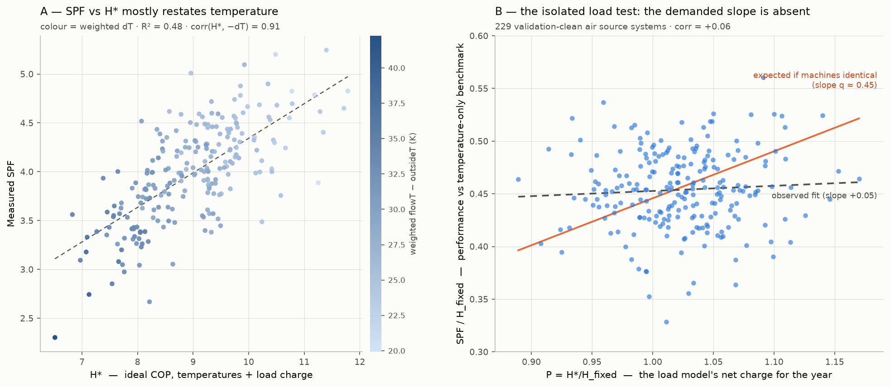

# H* on the real fleet: results

Definitions:

- H*: heat-weighted harmonic Carnot COP with load-dependent offsets
- H_fixed: same accumulation with the fixed +2/−6 convention
- q: % of ideal carnot, condensing vs evaporator temp not flow/outside —
  the fraction of H\* a machine/install actually achieves (SPF = q·H\*
  under the load model); fleet median ≈ 0.45
- P: H\*/H_fixed — the net charge the load model applies to a system's
  year (P > 1: heat delivered gently; P < 1: run hard); fleet sd 4.7%.
  Dividing by H_fixed cancels the temperature signal common to both
  benchmarks, so P isolates the load part of H\*.

Key points:

- Empirical test of the H\* metric (doc 05) against raw feeds for the
HeatpumpMonitor.org fleet.
- **H\* does not beat weighted dT as an SPF predictor on the real fleet**
- Tested first with load-dependent offsets (+3r/−8r) but also with grid search, to no avail! 
- Sim predicted R2 0.9, real world data R2 0.484 (worse than R2 0.602 for weighted dT!)

Informative residual structure:

The model SPF = q·H\* can't be tested by regressing SPF on H\* directly —
H\* is ~90% temperature signal, which would swamp the load part under
test. So divide both sides by H_fixed (algebraically the same equation):
SPF/H_fixed = q·P. Both axes now have the temperatures cancelled out —
the left side is performance relative to the temperature-only benchmark,
the right side is just the load charge. 

If all machines were identical, SPF/H_fixed would rise with P at slope
q ≈ 0.45 — worth ~0.2 SPF per sd of P. Observed slope: **+0.05 — flat.**
The over/under-performance the load model demands is not there.

*Panel A: SPF against H\* is dominated by the temperature signal (colour
= weighted dT), so it cannot test the load charge. Panel B: the isolated
test — the orange line is what identical machines would show; the
observed fit is flat.*

*Expected line came from the dynamic_heatpump simulator: a fleet of machines all obeying COP = q · variable-offset-Carnot.*

Two possible explanations, indistinguishable from annual aggregates:

1. **R1 — the load dependent offset penalty is real but cancelled** (the COP model holds, the
   constant-q assumption fails): an opposing while-running effect of the
   same size runs against it. Standby, DHW share and water-dT metering are
   ruled out by the elimination tests below; low-modulation inefficiency
   and an install-quality-vs-sizing confound remain as candidates.
2. **R2 — there is nothing to cancel** (the constant-q assumption is
   moot, the COP model itself fails): the offset model overstates how the
   steady-state penalty annualises over real operating distributions.

Doc 10 proposes the measurement that can separate them. Either way, the
net load signal in annual SPF is ≈ zero, so applying the correction (H\*)
worsens prediction.

## Method

`scripts/feed_scan/feed_scan_4.php` scanned the raw 10s feeds (elec, heat,
flowT, returnT, outsideT) for every air source system matching the
`find_homes_like_this` filters (MID metering, H4 boundary, >330 days,
air-error auto-flag, `data_flag != 1`), accumulating in a single pass:

- H\* = Σheat / Σ(heat/carnot) with variable offsets (+3r/−8r)
- H_fixed, same accumulation with the fixed +2/−6 convention
- heat-weighted flowT / outsideT / dT / (flowT − returnT)
- a measured window SPF (Σheat / Σelec over coincident samples, standby
  included, matching `calculate_window_cops`)

Sample handling replicates the myheatpump processing scripts: nulls
forward-filled across gaps < 15 min (`remove_null_values`), weighted / H\*
sums require all five feeds present at the sample
(`process_weighted_average`), and the scan window is the midnight-aligned
(Europe/London) last 365 days used by `process_rolling_stats`, clamped per
system to feed availability.

Results: `analysis/performance_prediction/hstar_fleet.csv`, analysed by
`analysis/performance_prediction/analyse_hstar_fleet.py`. 254 systems
scanned; 7 skipped (missing feeds).

**Validation.** For ~90% of systems the feed-scan heat-weighted temperatures
match the recorded `weighted_*` stats to within a few hundredths of a K —
two independent pipelines agreeing (weighted flowT−returnT: mean |err|
0.08 K, 96% within 0.5 K). The validated subset used below (n = 229
air source) requires |calc dT − recorded dT| ≤ 0.5 K and |window SPF −
recorded combined_cop| ≤ 0.25.

The 25 excluded systems are almost all **cooling systems**, not bad data.
The published pipeline (`process_weighted_average` /
`calculate_window_cops` in the myheatpump app) inverts cooling's negative
heat to *positive* and includes it in both `combined_cop` and the weighted
temperature sums; the feed scan excludes it (`h > 0` filter) from the
weighted sums and lets it *subtract* from the window heat total. Both
discrepancy signatures reconstruct quantitatively from published cooling
fields alone: mixing the scan's heating-only dT with
`cooling_heat_kwh` at `cooling_flowT_mean − cooling_outsideT_mean`
reproduces the recorded weighted dT to ~0.2 K (e.g. system 521: predicted
18.6 vs recorded 18.4, against a heating-only 31.2), and adding
`2 × combined_cooling_kwh` back to the scan's heat total reproduces the
recorded COP to ~0.15. Every large-mismatch system has ≥300 kWh/yr of
cooling; feed quality is >93% for all of them. For a heating performance
metric the feed scan's exclusion is the right choice — but its window SPF
for cooling systems is biased low (cooling elec counted, cooling heat
subtracted), so the ≤0.25 COP-agreement filter correctly removes them
rather than hiding the issue. A residual handful of excluded systems
(428, 539, 685) instead have very low `quality_outsideT` (2.5–62%), where
both pipelines compute weighted stats over different small subsets.

Ground source systems are excluded: H\* reconstructs the evaporator from
outside air, which is wrong for a ground loop (system 204, GSHP, showed up
as a spurious SPF/H\* = 0.53 before filtering).

The scan was re-run with the forward-fill, five-feed coincidence and
midnight-aligned-window semantics of the published pipeline after a first
pass without them; every headline number moved by ≤ 0.02 R² and no
conclusion changed, confirming those differences were negligible. The only
remaining deliberate divergence is the cooling inversion described above,
plus two immaterial ones: the published daily figures aggregate
heat-weighted per day while the scan accumulates the window in one pass,
and the recorded stats' "today" partial day ends at the last daily-stats
cron run rather than the newest feed sample.

## SPF prediction (n = 229, validated air source)

| Annual metric | R² | 90% PI | sim predicted |
|---|---|---|---|
| weighted flowT − outsideT (current) | **0.602** | ±0.51 | 0.63 |
| H (fixed +2/−6 harmonic Carnot) | 0.580 | ±0.53 | 0.64 |
| H\* (variable +3r/−8r) | 0.484 | ±0.58 | 0.90 |

The first two rows reproduce both the doc 05 fleet baseline (0.60/0.598)
and the simulator's prediction that fixed-offset harmonic averaging gains
nothing. The third row is the new empirical fact: **the load-dependent
variant loses ~0.12 R² instead of gaining ~0.26.**

Cross-validated multi-variable fits say the same thing more sharply:

| Model | cv R² |
|---|---|
| dT alone | 0.595 |
| dT + mean load ratio | 0.588 |
| H_fixed + H\* | 0.563 (H\* coefficient ≈ 0) |
| dT + running hours | 0.614 |

Mean load ratio (heat_kWh_running / capacity·running_hours, range 0.21–1.12
across the fleet) carries **no net SPF signal beyond dT**. Any metric that
bakes a load-ratio penalty into the predictor can only add noise.

## Why: the load penalty is real but cancelled

The residual of SPF ~ H\* correlates **+0.37 with mean load ratio**
(r̄ = mean heat output while running / rated capacity — *not* annual
utilisation; SPF/H\* vs r̄: r = +0.48), i.e. H\* systematically under-predicts
hard-working systems and over-predicts lightly-loaded ones. For comparison,
SPF/H_fixed vs load ratio is +0.07 — the flat published-prc_carnot picture —
and the SPF ~ dT residual vs load ratio is +0.09.

Doc 05 (point 3) predicted this configuration: identical machines would show
a *negative* load slope under the fixed convention (−0.75 correlation in the
sim). The counterfactual can also be computed entirely within the fleet,
and most cleanly with **no load-factor axis at all**: under the offset
model SPF = q·H\*, so SPF/H_fixed = q·P with P = H\*/H_fixed the system's
annualised modelled penalty (P is a functional of the instantaneous load
distribution alone; it is essentially determined by the heat-weighted mean
load ratio, corr −0.99). Identical machines require slope q ≈ 0.45 of
SPF/H_fixed against P; observed: +0.05 (corr +0.06). **Conditional on the
offset model**, quality must therefore anticorrelate with P almost exactly
— the two effects cancel in SPF, and removing one (H\*) without the other
makes prediction worse. The +0.48 slope of SPF/H\* against mean load ratio
is not independent evidence of this — it is mechanically the flat fixed
score divided by P. And the conditionality matters: if the model overstates
how the steady-state penalty annualises over real operating distributions,
the flat observation needs no offsetting effect at all. The simulator
cannot arbitrate (it *is* the offset model); the sim only saw the H\* gain
because its machines were identical by construction — exactly the caveat
in doc 05. (Note "load factor" here always means the heat-weighted or
while-running mean load ratio r̄ — never annual utilisation/capacity
factor, which is a different quantity, corr +0.53 with r̄.)

**What the offsetting effect is NOT** (elimination tests against the
published running/water splits and the scan's weighted water dT):

- *Standby share*: median only 2.4% of electricity (IQR 1.6–3.3%). Points
  the right way (corr with SPF/H\* = −0.31) but the decisive test fails:
  replacing SPF with **running COP** (standby excluded) leaves the load
  slope unchanged, +0.49 vs +0.48. The effect happens **while running**.
- *DHW share*: corr with SPF/H\* = +0.03 (n = 141 with a DHW split), and
  barely varies with load factor. Not the mechanism.
- *Water dT / metering floor proxy*: controlling weighted flowT−returnT
  leaves the load slope at +0.45; load ratio fully absorbs the small dT
  correlation (+0.12).
- *Mild-weather cycling transients*: not directly tested here, but field
  experience is that cycling COPs are often good, and the running-COP test
  above already localises the effect to in-run efficiency rather than
  operational overheads.

**How big a lever was annualised load factor anyway?** Modest, even before
the cancellation. Half the fleet sits in a narrow band (load factor IQR
0.43–0.59; full range 0.21–0.93), and the correction H\* applies relative
to the fixed convention (H\*/H_fixed) has sd 4.7% — worth about ±0.19 SPF
at η ≈ 0.45 against a between-system SPF sd of 0.49. Even as pure,
uncancelled signal that caps at ~15% of variance; 82% of H\*'s
between-system variance is just the temperatures it shares with dT. The
simulator overstated the load term's importance (R² 0.64 → 0.90) because
its 293 randomised designs deliberately spanned sizing/load-factor space
far more widely than real installs do. Fleet hierarchy: temperatures
~0.60 of variance, load factor ~0.15 at theoretical best and ~0 net,
the rest machine/install quality plus measurement noise.

That leaves two candidates, not separable from annual aggregates:
(i) the achieved **fraction of Carnot genuinely varies with operating
point** — compressor/inverter efficiency is poorest at minimum modulation
(visible as the 30 rps dip in the Vaillant Arotherm compressor map), so
low-load-factor systems concentrate runtime where η is worst; and
(ii) an **install/sizing quality confound** — well-loaded systems are
well-sized systems, which correlate with better design and commissioning
generally. The Arotherm datasheet map shows the steady-state penalty is at
least as large as +3r/−8r *at the test condition* (COP 3.3 → 4.6 from
120 → 40 rps at +7/35), but that cannot settle whether the penalty
survives real installation conditions and annualises to the modelled size
— which is the third possibility: no offsetting effect is needed if it
does not. Separating all three needs the per-machine stable-episode
analysis (COP vs load at fixed flowT/outsideT within single machines,
compared against manufacturer compressor maps) — planned in doc 10.

## As a quality score

| Score (n = 229) | mean | sd |
|---|---|---|
| SPF / H_fixed (window) | 0.454 | 0.037 |
| SPF / H\* | 0.444 | 0.041 |
| recorded combined_prc_carnot | 0.482 | 0.037 |

SPF/H\* does **not** show less between-system spread than the fixed-offset
score — the doc 05 success criterion is not met. The ~3-point flattery of
the fixed convention is confirmed (0.454 vs 0.444 means, matching the sim's
0.474 vs 0.444), but the spread is unchanged. The load-quality correlation
means SPF/H\* is not purely a machine score either: it now *reveals* the
sizing/load effect (+0.48) instead of hiding it (+0.07), which makes it a
useful diagnostic axis but not a fairer ranking.

## Offset grid search: no offsets beat dT

To rule out "the +3/−8 coefficients are just wrong", `feed_scan_5.php`
exported a per-system heat-weighted histogram of (flowT, outsideT, load
ratio) — ~14k bins/system storing heat-weighted means, reconstructing any
offset-family metric offline to ~1e-5 relative error
(`analyse_hstar_offsets.py`). A search of 1092 combos of
`Tcond = flowT + a0 + a1·r`, `Tevap = outsideT − b0 − b1·r` by 10-fold
cross-validated R² of SPF ~ H, run under two load-ratio definitions
(r = heat/badge capacity, and r′ = r normalised by the system's own
heat-weighted 98th-percentile output, which is immune to badge-engineered
capacity ratings — e.g. identical hardware sold as 9–16 kW):

| | best combo | cv R² |
|---|---|---|
| weighted dT (baseline) | — | **0.595** |
| best fixed-only | broad plateau, a0+b0 ≈ 8–12 K | 0.574 |
| published +2/−6 | | 0.572 |
| best load-dependent (both r definitions) | **a1 = b1 = 0** | 0.566 |
| H\* +3r/−8r | | 0.477 |

The optimum load coefficient is exactly zero under both capacity
definitions, and the *entire* harmonic-Carnot family — any offsets — caps
out ~0.02 below plain weighted dT. The fixed-offset direction is a flat
plateau in total lift shift (a0+b0), insensitive between ~8 and ~12 K.
This closes the metric-search line: the failure of H\* is not a wrong
coefficient, and not badge-capacity noise.

Two side-findings from the histogram: the empirical peak output is
median 1.33× badge capacity (IQR 1.09–1.67) — direct evidence that rated
capacity is a poor proxy for hardware — and a handful of systems show
physically impossible peaks (5 kW badges "delivering" 26–49 kW at the 98th
heat-weighted percentile), i.e. heat-feed spike artifacts worth a data-QA
follow-up.

1. **Do not replace weighted dT with H\*** for fleet SPF prediction; dT
   remains the best single published metric (R² 0.60 on this subset).
   Adding runtime hours gives a marginal +0.02.
2. The H\* accumulator and the existing weighted-stats pipeline
   cross-validate to hundredths of a K — both are correct.
3. The interesting physics survives: **quality rises with load factor** in
   the real fleet, worth ~0.4–0.7 correlation depending on convention. The
   oversizing penalty of doc 03 is real but is a *quality* effect (which
   machine/sizing you bought), not an *operating-temperature* effect — so it
   is invisible to any metric built from temperatures and load alone, and
   partially self-cancelling in SPF.
4. The offset grid search (above) closed the scaled-offsets question: no
   coefficients rescue the family. The remaining open thread is
   *understanding*, not fleet prediction: fit effective per-machine offsets
   from stable episodes (feed_scan_2) to separate "real offsets are small"
   from "quality rises with load", and feed the machine-quality term into a
   two-stage model (SPF ≈ η(model, sizing) × H) per doc 07/08.

---
*Files: `scripts/feed_scan/feed_scan_3.php` (single system),
`scripts/feed_scan/feed_scan_4.php` (fleet scan),
`analysis/performance_prediction/hstar_fleet.csv` (results, one row per
system incl. recorded stats for comparison),
`analysis/performance_prediction/analyse_hstar_fleet.py` (this analysis).*
