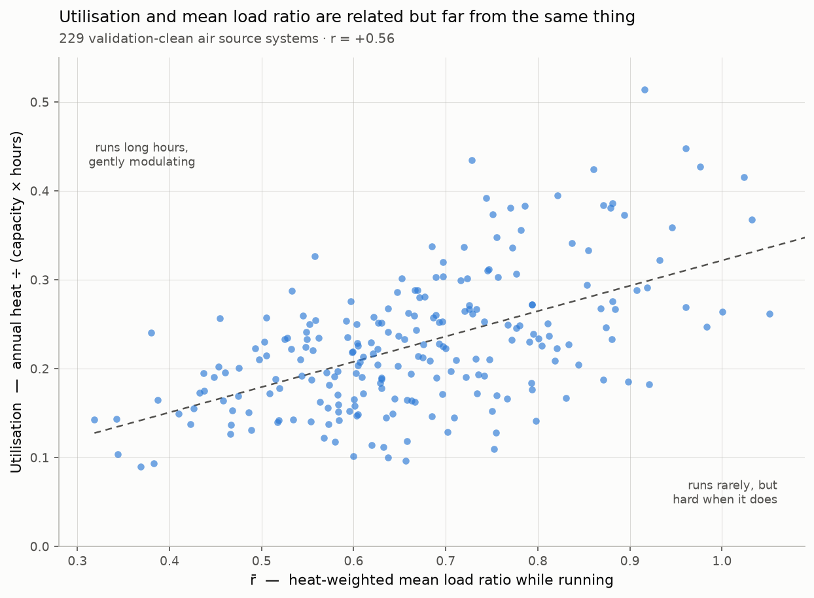

# 11 — Note: utilisation and mean load ratio are different quantities

*2026-07-17. Side note from the doc 09/10 discussion; data from the
feed_scan_5 histograms, 229 validation-clean air source systems.*

Two annual summaries of "how hard a heat pump works" are easy to conflate
and must not be:

- **r̄** — heat-weighted mean load ratio *while running*
  (Σ heat·r / Σ heat, r = instantaneous output / rated capacity).
  Fleet median 0.66, sd 0.15.
- **Utilisation** (capacity factor) — annual heat / (capacity × all
  hours), off-time included. Fleet median 0.22, range 0.09–0.51.

They answer different questions: r̄ describes *where on the modulation
range the machine sits when it runs*; utilisation describes *how much of
the year's theoretical maximum it delivered*. A system that rarely runs
but flat-out when it does has high r̄ and low utilisation; a long-running
gentle modulator is the opposite.

Fleet measurement: **r = +0.56** — related, but loosely. Both are
downstream of sizing relative to demand, which produces the trend; but at
fixed r̄ ≈ 0.7 utilisation still spans 0.10–0.44 (climate, house demand,
DHW share, schedule). Neither is a proxy for the other.

Why it matters here:

1. The doc 09 load-cancellation analysis uses **only r̄** (and, more
   precisely, the annualised penalty P = H\*/H_fixed, a functional of the
   full instantaneous distribution). Utilisation appears nowhere; any
   reading of "load factor" as utilisation misreads the result.
2. Fleet utilisation being low (median 0.22) is the expected consequence
   of design-day sizing, not evidence of oversizing by itself — the
   oversizing signal lives in the r(t) distribution (doc 03's share of
   heat below 40% of rated output) and in cycling behaviour, not in
   utilisation.
3. When reading manufacturer compressor maps (doc 10), the relevant axis
   is instantaneous output — annual summaries of either kind cannot be
   placed on a map.

---
*Figure: `figures/utilisation_vs_rbar.png`. Computation: heat-weighted r̄
from `hstar_hist.csv`; utilisation from `hstar_fleet_hist.csv`
(heat_kwh_running / (hp_output × 24 × days_scanned)).*
