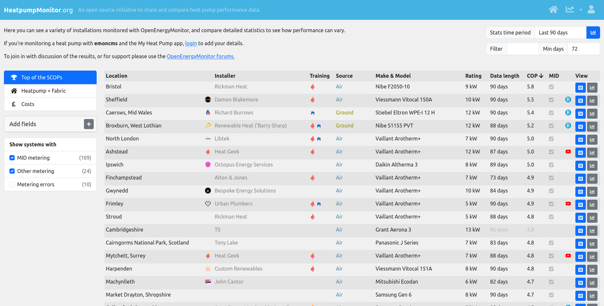

# HeatpumpMonitor.org

An open source initiative to share and compare heat pump performance data.

## See: [https://heatpumpmonitor.org](https://heatpumpmonitor.org)

## Install on existing Apache2 server

Install public site content in /var/www

    sudo ln -s /home/USERNAME/heatpumpmonitor.org/www/ /var/www/heatpumpmonitororg
    
Create a mariadb/mysql database:

    CREATE DATABASE heatpumpmonitor;
    
Copy example.settings.php:

    cp www/example.settings.php settings.php
    
Modify database credentials to match your system

Load public data from heatpumpmonitor.org to create functioning development environment

    php load_dev_env_data.php

Login using 'Self hosted data' and username and password: admin:admin

## Run using Docker

    docker compose build
    docker compose up

Site should now be running on <http://localhost:8080>

Emoncms runs on <http://localhost:8081> (same compose stack).

### Optional: load Emoncms testdataset feeds

The [testdataset](https://github.com/emoncms/testdataset) repo (clone as a sibling of this project, or set a custom path) can populate phpfina feeds into your dev Emoncms MySQL user for apps such as MyHeatpump.

- **Enable:** `docker compose --profile testdata up` (or add `--profile testdata` when you already use `up`). This starts one-shot service `load_emoncms_testdata` after `load_dev_env_data` and a healthy `emoncms` container.
- **`TESTDATASET_PATH`:** Host path to the testdataset repo. Default in compose is `../testdataset` (relative to this project directory). Set in a `.env` file next to `docker-compose.yml` if your clone lives elsewhere (absolute path recommended).
- **`TESTDATASET_EMONCMS_USER_ID`:** Numeric Emoncms user id to attach feeds to. Default `1` (the `admin` user created by `load_dev_env_data` when `LOAD_USERS=1`). Override in `.env` e.g. `TESTDATASET_EMONCMS_USER_ID=2` for `user2`.
- **`PHP_CLI_MEMORY_LIMIT`:** PHP CLI memory for `add_feeds_to_account.php` / `post_process.php` (default `1024M`). Raise in `.env` if postprocess still exhausts memory.

After the feeds are imported, `load_emoncms_testdata` also runs `docker/testdataset/configure_hpm_app.php` to:

1. Create a `myheatpump` app in Emoncms for the target user (via `/app/add.json` + `/app/setconfig.json`).
2. Map the testdataset feeds (`heatpump_elec`, `heatpump_heat`, `heatpump_flowT`, ...) into the app config by name.
3. Point the user's heatpumpmonitor `system_meta` row at the new `app_id` + `readkey` (creating one if missing).

Overrides (set in `.env` beside `docker-compose.yml`): `HPM_APP_NAME` (default `My Heatpump`), `HPM_SYSTEM_LOCATION` (default `Test System`). This step is idempotent — re-running will reuse an existing app with the same name and update the same `system_meta` row.

Re-running the loader may append or duplicate data; reset the `emon-phpfina` volume (and re-run stack) for a clean feed store.

Scripts and layout: [docker/testdataset/](docker/testdataset/).

## Users

Login using 'Self hosted data' and username and password: `admin:admin` for the admin user and `user<N>:password` for any of the users accounts
